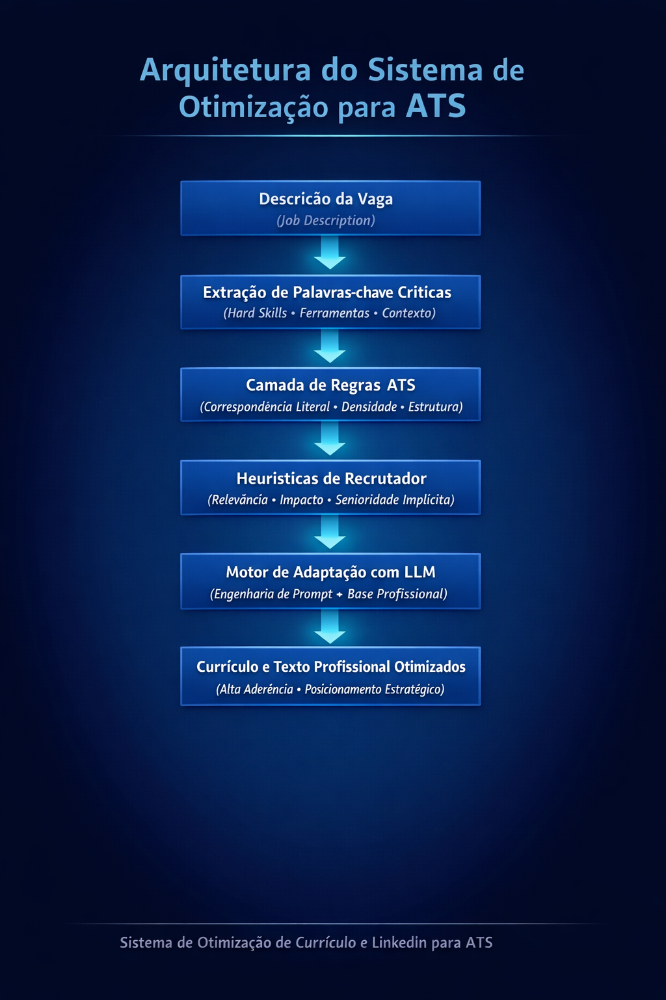

# 🧠 Sistema de Otimização de Currículo e LinkedIn para ATS

Sistema inteligente baseado em LLM para adaptação estratégica de currículo e perfis profissionais, com foco em otimização para ATS e aumento da taxa de conversão em entrevistas.

---

## 📌 Sobre o Projeto

O **Sistema de Otimização de Currículo e LinkedIn para ATS** foi desenvolvido como projeto aplicado em bootcamp, com o objetivo de estruturar um mecanismo inteligente de posicionamento profissional orientado a dados.

A proposta é transformar uma base fixa de experiências e projetos em versões personalizadas e semanticamente alinhadas a cada descrição de vaga, maximizando aderência técnica e percepção estratégica.

O sistema combina:

- Engenharia de Prompt  
- Heurísticas de recrutamento  
- Princípios técnicos de ATS  
- Estratégia de posicionamento profissional  

---

## 🚀 Problema Resolvido

Grande parte dos candidatos utiliza o mesmo currículo para múltiplas vagas, resultando em:

- Baixa correspondência em sistemas ATS  
- Falta de aderência às palavras-chave da vaga  
- Narrativa desalinhada ao contexto da empresa  
- Redução da taxa de entrevistas  

Este sistema resolve esse problema por meio de adaptação estruturada e orientada a critérios objetivos.

---

## 🏗 Arquitetura do Sistema

O modelo é estruturado em quatro camadas:

### 1️⃣ Base Profissional
Identidade, stack técnica e banco completo de experiências.

### 2️⃣ Projetos Estruturados
Contexto → Problema → Métricas → Impacto → Ferramentas.

### 3️⃣ Princípios de ATS
Regras de correspondência literal, densidade estratégica de palavras-chave e estrutura compatível com parsing automatizado.

### 4️⃣ Heurísticas de Recrutador
Critérios de triagem rápida, relevância contextual e percepção de senioridade implícita.

---

## 🎯 Funcionalidades

✔ Extração automática de palavras-chave críticas  
✔ Identificação do foco estratégico da vaga  
✔ Reescrita otimizada do resumo profissional  
✔ Reordenação de experiências por relevância  
✔ Geração de versão ATS (keyword-driven)  
✔ Geração de versão narrativa estratégica  
✔ Identificação de gaps de aderência  

---

# 📊 Exemplo de Fluxo

1. Inserir descrição da vaga  
2. Sistema extrai palavras-chave críticas  
3. Adapta currículo para correspondência máxima  
4. Gera versão estratégica alinhada ao contexto da vaga  
5. Aponta melhorias e ajustes  
6. Gera descrição profissional otimizada para ATS, adaptada semanticamente à vaga analisada, aplicável a diferentes plataformas de candidatura  

---

## 🖼 Visual do Projeto

---

## 📈 Diferencial Estratégico

Este projeto não realiza apenas reescrita textual.

Ele aplica:

- Correspondência semântica orientada à vaga  
- Estruturação estratégica de narrativa  
- Psicologia de decisão do recrutador  
- Otimização técnica para sistemas ATS  

O resultado é um posicionamento profissional mais assertivo, coerente e competitivo.

---

## 🛠 Stack Aplicada

- LLM (estruturação via NotebookLM)  
- Engenharia de Prompt  
- Modelagem de heurísticas de recrutamento  
- Estratégia de posicionamento profissional  

---

## 🛠 Slides Apresentação do Projeto

[Capa](./assets/capa_slide_apresentacao.png)

[Link para o projeto completo](https://notebooklm.google.com/notebook/ab87f6c5-3306-4e96-8a80-7783264611a4)

---

## 👨‍💻 Sobre o Autor

Victor Gagliano  
Analista de Dados | SQL • Python • Power BI  

Profissional com foco em análise estratégica de dados, atuando em projetos industriais, financeiros e comerciais. Especializado em estruturar indicadores, identificar padrões e conectar métricas à tomada de decisão orientada a impacto.

---

## 📌 Licença

Projeto desenvolvido para fins educacionais dentro de bootcamp, com aplicação prática em posicionamento profissional e estratégia de carreira.
